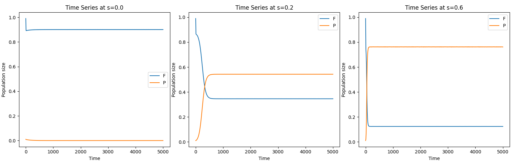
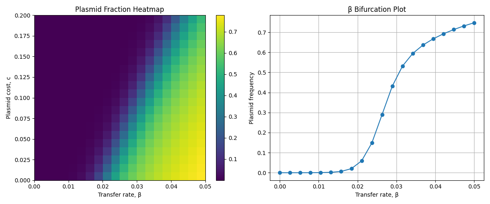
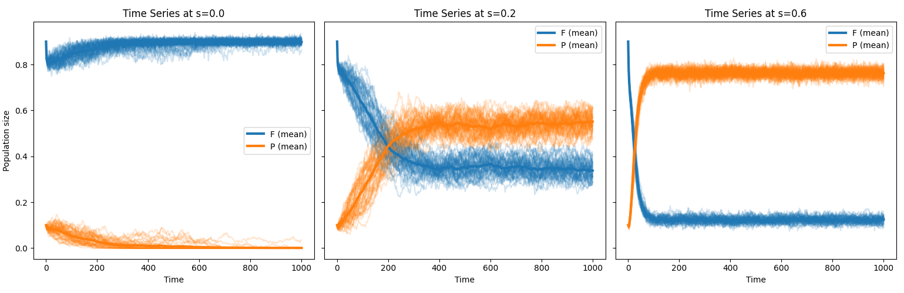

# Plasmid Dynamics Models

## Overview

Plasmid invasion dynamics are studied using two modelling approaches: 
- Deterministic ordinary differential equations (ODEs) 
- Stochastic simulation algorithm (SSA) 

Both models track the population dynamics of plasmid-free bacteria (F) and plasmid-bearing bacteria (P), incorporating: 
- Density-dependent population growth, N / K
- Plasmid transfer via conjugation, β
- Segregational plasmid loss, δ
- Plasmid-associated fitness costs, c
- Selective pressure, s

The deterministic model captures mean-field population behaviour, while the stochastic model resolves demographic noise and rare-event dynamics that arise when populations are small. Together, these approaches allow comparison between average behaviour and stochastic variability in plasmid persistence and invasion.

---

## Project Structure

```
├── main.py
├── parameters/
│   ├── params.json
├── ode_model/
│   ├── model.py
│   ├── charts.py
│   └── figures/
├── ssa_model/
│   ├── model.py
│   ├── charts.py
│   └── figures/
├── docs/
│   ├── appendix_A.pdf
│   ├── appendix_B.pdf
│   └── appendix_C.pdf
├── requirements.txt
└── README.md
```

---

## Installation

Prerequisites:
- Python 3.8 or higher
- NumPy
- SciPy
- Matplotlib

1. Close the repository:

```bash
git clone https://github.com/heitor-sg5/plasmid_invasion.git
cd plasmid-dynamics-models
```

2. Install Python dependencies:

```bash
pip install -r requirements.txt
```

---

## Usage

Run the program from the project root:

```bash
python main.py
```

This will:

1. load the parameters from `parameters/params.json`
2. Run deterministic ODE time-series simulations
3. Perform a β-cost parameter sweep
4. Compute analytical threshold conditions
5. Generate and save figures to `ode_model/figures`

For the stochastic SSA simulation:

```bash
python main.py --ssa
```

Arguments may be customised, for instance:

```bash
python main.py --ssa --runs 100 --TMAX 1000
```

Available CL options:

- `--params`: path to parameter JSON file
- `--TMAX`: maximum simulation time
- `--ode`: run ODE model
- `--ssa`: run SSA model
- `--runs`: number of SSA simulations

---

## Output

The following figures and conclusions were made:



### Figure 1: Deterministic ODE dynamics of plasmid-free and plasmid-bearing populations under varying selective pressure. 
Time series solutions of the ODE model showing the dynamics of plasmid-free cells (F) and plasmid-bearing cells (P) over 500 hours. Left: No selective pressure against plasmid-free cells (s = 0), under which the plasmid fails to invade and is lost from the population, resulting in dominance of plasmid-free cells. Middle: Moderate selective pressure (s = 0.2), where plasmid-bearing cells gradually invade and coexist with plasmid-free cells at an approximate equilibrium ratio of 0.6:0.4 (P:F). Right: Strong selective pressure (s = 0.6), leading to complete dominance of plasmid-bearing cells, with plasmid-free cells persisting only at very low frequencies. All other parameters are held constant. 



### Figure 2: Plasmid invasion threshold and equilibrium behaviour as a function of plasmid cost and transfer rate.
Left: Two-dimensional heatmap showing the equilibrium frequency of plasmid-bearing cells across sweeps of plasmid cost (c, 0–0.2) and plasmid transfer rate (β, 0–0.05) in the absence of selective pressure (s = 0). The boundary between plasmid extinction and invasion follows a linear relationship, with invasion occurring above the critical transfer rate $(δ+μc)/(K(1−μ/r))$. Small increases in transfer rate compensate for larger plasmid costs, reflected in the low ratio $β_{crit}/c$ = 0.322. Right: Bifurcation plot showing the equilibrium frequency of plasmid-bearing cells as a function of plasmid transfer rate. Plasmid invasion begins near β ≈ 0.017, followed by a rapid increase in plasmid frequency that slows as the population approaches saturation near carrying capacity, producing a rectangular hyperbola–like curve.



### Figure 3: Stochastic Gillespie SSA dynamics of plasmid populations under varying selective pressure.
Time series from Gillespie stochastic simulation algorithm (SSA) implementations of the model, showing plasmid-free (F) and plasmid-bearing (P) populations over 500 hours. Each panel displays 50 stochastic realisations (thin lines) with mean trajectories shown as thicker lines. Left: No selective pressure (s = 0), where plasmids typically go extinct as in the deterministic model, though approximately 2% of runs exhibit long-term plasmid persistence at very low frequencies due to stochastic effects. Middle: Moderate selective pressure (s = 0.2), resulting in coexistence between plasmid-bearing and plasmid-free cells at a mean ratio of approximately 0.6:0.4, accompanied by substantial stochastic variability in both populations. Right: Strong selective pressure (s = 0.6), leading to robust dominance of plasmid-bearing cells and suppression of stochastic fluctuations, closely matching deterministic ODE predictions.

---

## Documentation

An overview of the ODE model and its parameters is provided in `docs/appendix_A`. A detailed analysis, including equilibrium calculations and Jacobian derivations, is presented in `docs/appendix_B`. The Gillespie implementation of the SSA model is described in `docs/appendix_C`.

---

## References

Hernández-Beltrán, J.C.R., San Millán, A., Fuentes-Hernández, A. and Peña-Miller, R. (2021). Mathematical Models of Plasmid Population Dynamics. Frontiers in Microbiology, 12. Available at: https://pmc.ncbi.nlm.nih.gov/articles/PMC8600371/ 
Stewart, F.M. and Levin, B.R. (1977). THE POPULATION BIOLOGY OF BACTERIAL PLASMIDS: A PRIORI CONDITIONS FOR THE EXISTENCE OF CONJUGATIONALLY TRANSMITTED FACTORS. Genetics, 87(2), pp.209–228. Available at: https://pmc.ncbi.nlm.nih.gov/articles/instance/1213735/ 
Lopez, J.G., Donia, M.S. and Wingreen, N.S. (2021). Modeling the ecology of parasitic plasmids. The ISME Journal, 15(10), pp.2843–2852. Available at: https://pmc.ncbi.nlm.nih.gov/articles/PMC8443676/  
Prensky, H., Gomez‐Simmonds, A., Uhlemann, A. and Lopatkin, A.J. (2021). Conjugation dynamics depend on both the plasmid acquisition cost and the fitness cost. Molecular Systems Biology, 17(3). Available at: https://pmc.ncbi.nlm.nih.gov/articles/PMC7919528/ 
Lopatkin, A.J., Meredith, H.R., Srimani, J.K., Pfeiffer, C., Durrett, R. and You, L. (2017). Persistence and reversal of plasmid-mediated antibiotic resistance. Nature Communications, 8(1), pp.1–10. Available at: https://pmc.ncbi.nlm.nih.gov/articles/PMC5698434/ 
Ibarguen-Mondragón, E., Esteva, L., M. Victoria Otero-Espinar, Vega, E. and Miller Cerón-Gómez (2025). On qualitative properties of replication and transfer of conjugative plasmids encoding antibiotic resistance genes. Computational and Applied Mathematics, 44(5). Available at: https://link.springer.com/article/10.1007/s40314-025-03231-w 
